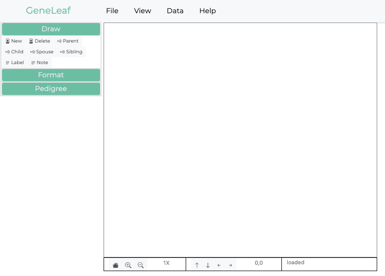

**************************************
Introduction
**************************************

a visual editor for genomics
============================================

Genetics is the study of family relationships which transfer the information that determines the phenotype of each individual in form of discrete hereditary units called genes. The medium in which mosts Geneticists typically work is the pedigree diagram or genogram. In these diagrams, the relationships between individuals are represented through a simplfied set of symbols, related through lines. Gene Leaf enables users to quickly capture information in this form through an intuitive user interface, which supports rapid entry of information. Gene Leaf allows users to work at their own pace and in their own way. A simplified icon set allows users to add information with simple clicks. 

General Concepts
============================================
GeneLeaf was developed with the needs of the end user in mind. It is designed to bring powerful analytics to users while reducing the overall effort required to perform key actions.

Intuitive
--------------------------------------------
The interface is designed to be as simple as possible, allowing users to find key functionality rapidly through the design approach summarized by:

    **TMTOWTDI** - *There's more than one way to do it*

For most common user actions, we support a basic way of doing it, which is easily described as well as a fast shortcut which can be performed rapidly by advanced users.

Data-Driven
--------------------------------------------
Pedigrees have always been a unique form of data representation, in that they convey a large amount of detailed information visually. GeneLeaf supports this approach by supporting pedigrees with a rich, extensible data model which enables users to add and maintain a full family history in a compact data format. The data model for each pedigree controls how it is drawn. Users can determine how each data field is represented on the pedigree diagram through the specification of customized formatting rules.

Interoperable
--------------------------------------------
One of the frustrating aspects of drawing and maintaining pedigree drawings is the diverse assortment of alternative software applications available for users, which seem to come in and out of fashion on a fairly regular basis. GeneLeaf aims to be a simple, universally compatible tool which allows users to take their pedigrees from any platform, edit and update them and export them in a format which is easily usable by the platform of his or her choice. If you decide to use our platform at an enterprise level, we are here to support you, but we plan to maintain this application as a free tool for all users on a permanent basis.

