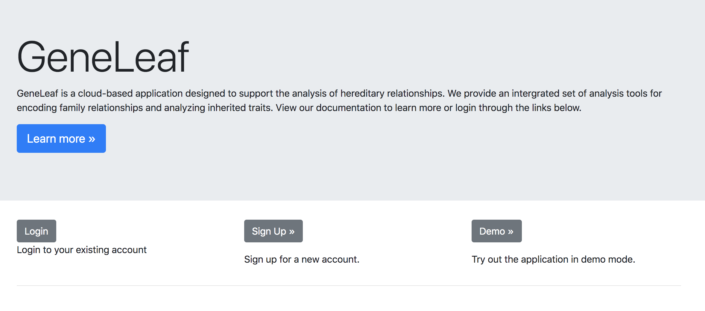
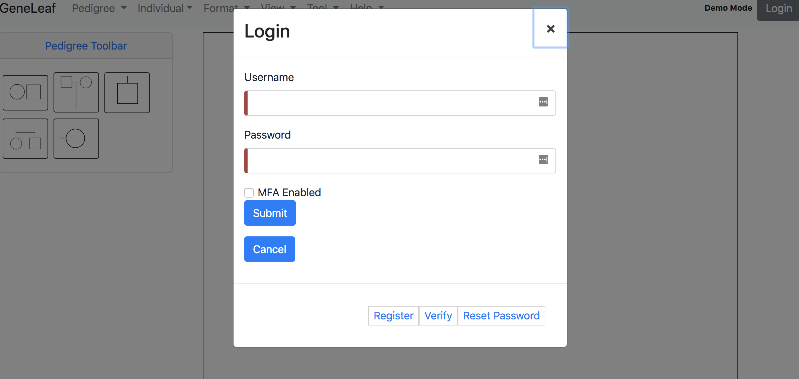
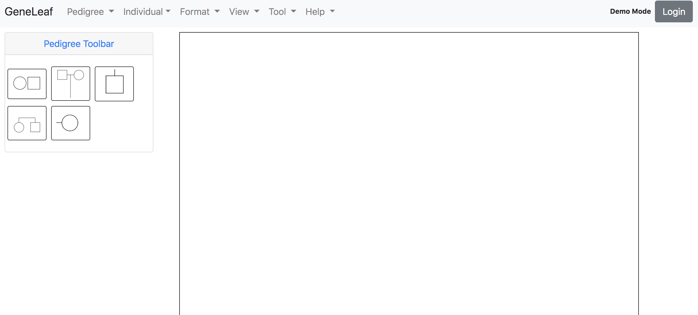

*************************
Getting Started
*************************

Introduction
============================================
GeneLeaf is a visual editor for family relationshipts, allowing users to rapidly generate and edit visual diagrams of family information, called pedigrees or genograms. GeneLeaf is designed to be flexible and supports multiple modes of interaction, allowing users to work in the way that works best for their needs. This section is provided to enable users to start using the application and topics are covered in greater depth in the user manual.

Pedigrees
============================================

Pedigrees are visual representations of family relationships. These follow a specific set of formatting conventions to represent family information. These include the following key components:

* Squares/Circles: used to represent males & females
* Affected: color (including black) is used to indicate that an individual is affected by a condition.
* Spousal relationships: represented by horizontal bars between individuals
* Sibling relationshipts: represented by horizontal bars above individuals
* Generation relationshipts (parents/children): represented by vertical bars

.. image:: ../figures/Pedigree_Affected.png
    :width: 200 px
    

In the figure above, two cousins members (1 male and 1 female) are affected.

First Steps
============================================
GeneLeaf is designed for usability. Follow the steps below to get started:

* Intro page:

The intro page displays updates and enables users to select their prefered user experience based on their use case.

* Login:

Users can login at any point during their session by clicking the **login** button.

* Drawign Mode:

In drawing mode, users can start drawing pedigrees immiately, either using the functionality through menus or by keyboard shortcuts.
